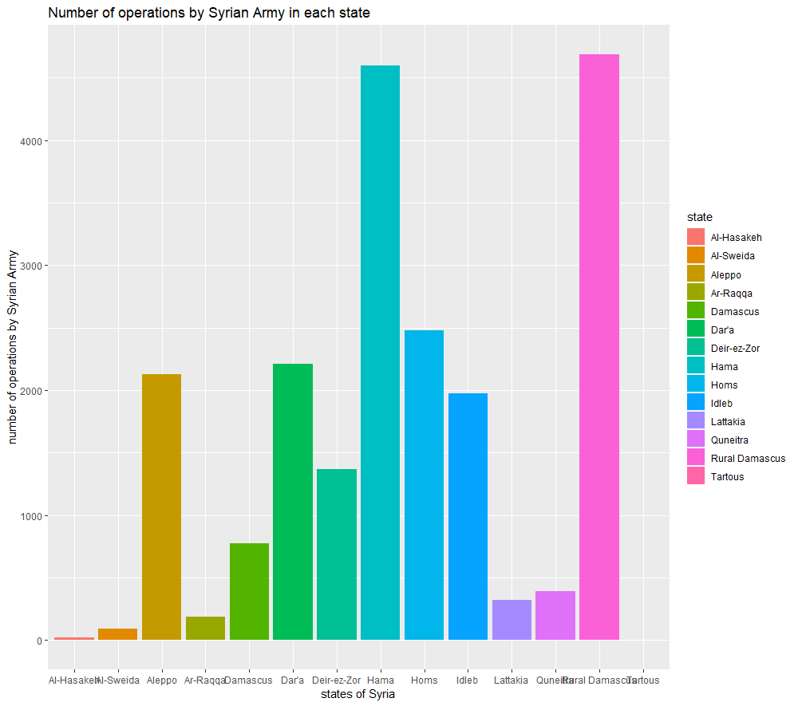

\fontsize{22}{22}

## A quick Introduction to the war.

It has already been 7 years and 5 months since the War in Syria began, with around five hundred thousand people dead, eight million IDP's ( internally displaced personal), and 5 million refugees, this was has been one of the bloodiest wars in the recent history.

### The dataset

#### During my research I have stumbeled upon a dataset about the Syrian war provided from [HDX](https://data.humdata.org/) (The Humanitarian Data Exchange), the dataset on the war was contribuited by the ACLED (Armed Conflict Location & Event Data Project) the link to the dataset can be found [here](https://data.humdata.org/dataset/acled-data-for-syrian-arab-republic#).
#### All information about how ALCED  collects, cleans, reviews and checks event data is provided in their **website**.

#### **Note** ALCED states that not all of their data especially on the casualty is completely accurate.

#### The dataset specifies each event in a row while providing with:

#### * Date
#### * event ID
#### * The coutry code
#### * year
#### * event type
####     + specifies if it's an air strike, bombardment, suicide attack etc...
#### * first team (attackers)
####     + and if there's any assister
#### * second team (defenders)
####     + and if there's any assister
#### * State specified with
####     + City
####     + Street
#### * Latitude
#### * longtitude
#### * source
#### * a description of the event
#### * number of fatalities
 
#### The Data provided only includes the last 2 years of the war 2017-2018

## Some Analysis based on the data

### changes by year.

#### First of I wanted to visualize the casualty count during the amout of time this dataset goes on

#### As it is visible there is a difference between the years of 2017 and 2018 especially after may.
#### In the modern warfare it is believed that once the number of deaths start to shrink then the end of the war may be near.

***

#### beside the number if casualties I also wanted to show the difference between the number of operations done in each year, the first graph simply visualizes the number of operations done by the main Syrian army, supporting militias were not counted in this graph neither airstrikes by Russians or Americans

#### and now the attacks against the Syrian army by the rebels

#### and of course the number of casualties is dependent on the number of casualties.

#### the last two graphs mainly provides us with who is controlling the war at the moment. Since the Syrian army is doing ten time more operations it is acceptable to assume that the government forces are winning for the moment.

***

### Data based on the states of Syria

#### During the war some states have seen more actions than others and based on this graph we can see that

#### Deir ez Zor and Rural Damascus has seen the most fights and of course

***

***

### Mapping the battles

#### since we have longtitude and latitude I thought it would be intresting to show the where the battles occured in Syria over the past 2 years of the war **only**.

###### **Note** most of the locations aren't precise so instead it shows the city or somewhere near it

#### and of course we can check each states individually like 

***

### Based on Month

#### in the following graph I visualized the locations of the most intense battle which occured during September of 2017

#### and of course last one 

## Resources

1. D. Kahle and H. Wickham. ggmap: Spatial Visualization with ggplot2. The R Journal, 5(1), 144-161. URL http://journal.r-project.org/archive/2013-1/kahle-wickham.pdf

2. https://ourworldindata.org/war-and-peace

3. https://data.humdata.org/dataset/acled-data-for-syrian-arab-republic
